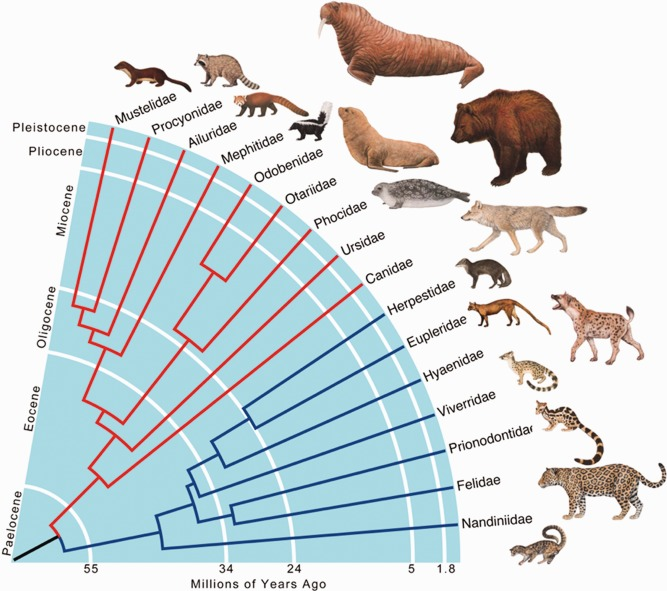
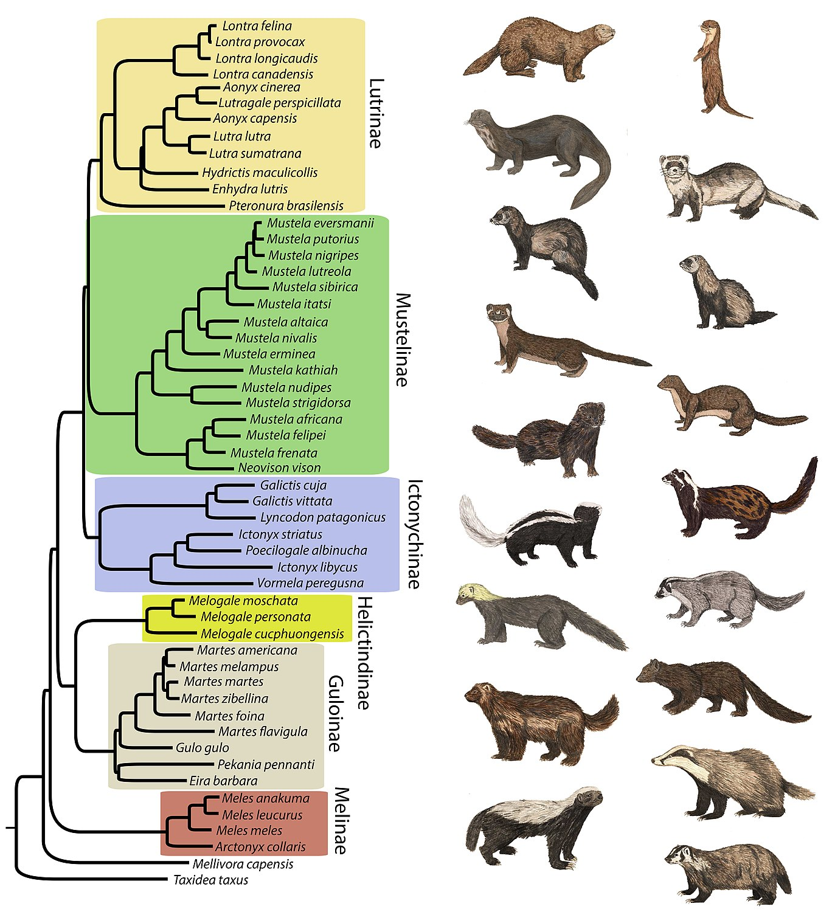
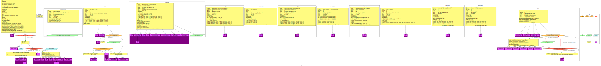

# Programming Assignmeng 00 (pa00)

A weasel walks into a bar.
The bartender asks, "What can I get you?"
Pop, goes the weasel.





https://en.wikipedia.org/wiki/Weasel_program

http://rationalwiki.org/wiki/Dawkins_weasel

# Part 0
Actually review the following (you should know this already, but if not, now is the time!):
* https://www.cnsr.dev/index_files/Classes/DataStructuresLab/Content/00-VirtualMachines.html
* https://www.cnsr.dev/index_files/Classes/DataStructuresLab/Content/01-02-LinuxBash.html
* https://www.cnsr.dev/index_files/Classes/DataStructuresLab/Content/03-VersionControl.html
* https://www.cnsr.dev/index_files/Classes/ComputationalThinking/Content/11-TypeHints.html
* https://www.cnsr.dev/index_files/Classes/ComputationalThinking/Content/16-TypeFormatDebug.html
* https://www.cnsr.dev/index_files/Classes/ComputationalThinking/Content/18-InputOutput.html
* https://scipy-lectures.org/intro/index.html


# Part 1: Set up your machine
Follow instructions here:
https://www.cnsr.dev/index_files/Classes/DataStructuresLab/Content/00-VirtualMachines.html

In EC, you can use the pre-prepared OpenSuse OVA option (downlod on my opensuse wikipage),
or whatever you would prefer that works.

# Part 2: Get your repository onto your machine
1. In your VM OS, open Firefox, and log into https://git-classes.mst.edu using your MST SSO credentials.
2. In git-classes, find the repository for this assignment, note the blue "clone" button/link; you want the https one, not the git@ one for now (unless you know what ssh keys are and how to use them).
3. In your class VM, open a terminal, and run these commands:
```sh
cd
tree 
cd Documents/CS****/ # where **** is your class (create if needed)
git clone https://git-classes.mst.edu.....thelinkyoucopiedatthegitstepabove
cd therepodirectoryyoujustcloned
```
In case it was not clear, you need to replace parts of the commands above with information specific to you.

# Part 3: Run the auto-grader
Run the following in the root directory of your repository:
`./grade.sh`

## Errors
You should not change any of the grading files themselves. 
If you do, you will see a warning, and it will give you a 0.
If you accidentally did that:
`git checkout firstfourcharactersoflastcommitbyus graderfileyoubroke`

## Is the auto-grader broken?
Is the error you're encountering our fault or yours?
Either may be possible, while the latter is much more likely.
Double-check all the diffs, and step through all code to see.
If you think you found a bug, please let us know!

# Part 4: Do the assignment

## How to code?
Let the autograder guide you! 
It's usually a good idea to do work in the order the autograder checks you.
Using this script, we strongly encourage you to program incrementally. 
Program code required by the unit tests, in the requested order. 
In general, don't procede to a later function, if you are not passing the first one.
If you get stuck, instead of moving on, get help!
See the syllabus for extended coding tips.

## Sample problem description
An introductory assignment: Methinks it looks like a weasel

### Problem description
Implement the basic functions provided!

### Control Flow Graph (CFG) generated from your code

This is a big hint (you should probably check this out)!
I don't have it graded, but you may be curious abou the stuff in the corresponding directory.

# Part 5: Play with the debugger
1. pudb
```sh
man pudb # or man pudb3 depending on your machine
pudb convert_to_binary.py
```
Practice stepping into the function and through the for loop with pudb3.

2. Open the same file in Spyder3 and practice stepping through it using the debugger 
(read the manual for help).

# Part 6: Try some diff methods
In the virtual machine, run at the bash command line:
```sh
diff -y --color "unit_tests/unit_test_1.py" "unit_tests/unit_test_10.py"

vim -d "unit_tests/unit_test_1.py" "unit_tests/unit_test_10.py"
# To exit vim, type esc followed by :qa

meld --diff "unit_tests/unit_test_1.py" "unit_tests/unit_test_10.py"
```

# Part 7: Submit your work!
Finally, to submit all your work, it is time to manage these files you created within your Git repository.
They must all be in the folder created when you cloned your Git repository.
From within your git repository (folder), add, commit, and push all the non-generated files. 
This means add your cpp and py files, for example, but not a.out, etc.
These commands should move your edits to the repository to the git-classes server:
```sh
git add file1
git add file2
# where you do this for all your files
git commit -m "Time to git committed to this ;)"
git push -u origin master
```

# Part 8: Check your work!
Read the resulting message Git prints!
Most importantly, to check all your previous Git-related steps worked, using the web browser, navigate back to the repository, and confirm all the files you added are visible in the Gitlab web interface.
If the files are not visible, you will not be graded for them, and you should go ask for help!
If you can see the correct files on git-classes in your master branch, your push is complete.
Make sure all the requested files are in the root directory of the repository unless otherwise specified.

To determine whether your project is finished:
Check out the git-classes Gitlab CI (details in the general syllabus). 
If it turns green AND the details show a 100, then you're good! 
If it's still red or you are less than 100, you need to fix your project.
This test checks both that you got your files submitted correctly, and that your submission was correct!

## How to make sure I'm getting points?
* Click on CI/CD -> Jobs -> the latest job.
* What grade does it say you have?
* Whatever grade the latest job says, is what we think you have!
